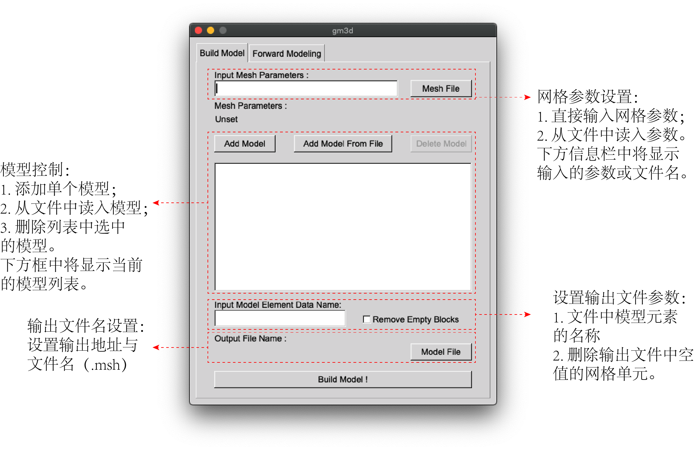
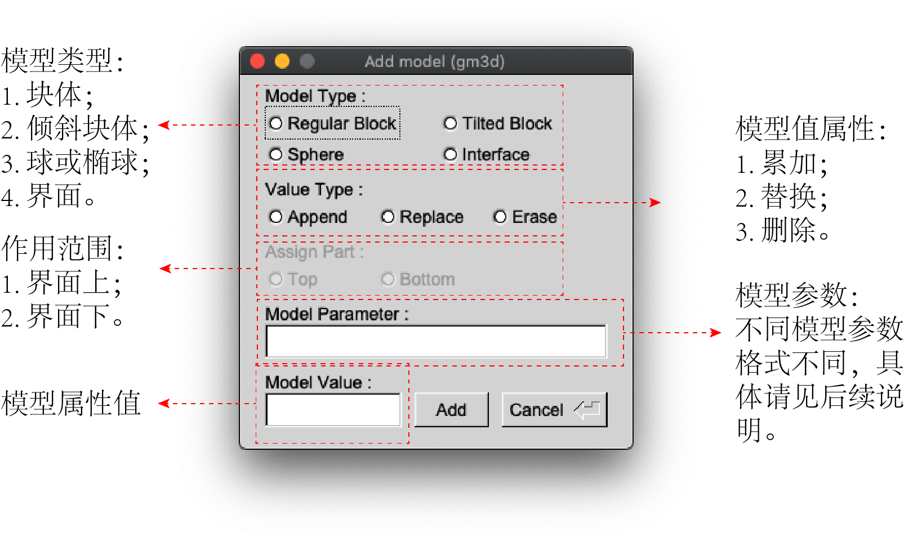
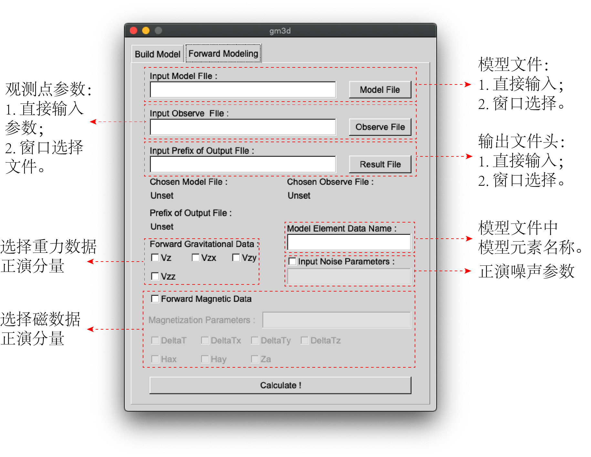

# gm3d-gui程序说明书

作者：张壹（浙江大学地球科学学院），孙石达（华中科技大学引力中心）

E-mail：zhangyiss@icloud.com

## 简介

gm3d-gui是一个开源的直角坐标系下的三维密度或磁化率模型建模与重磁数据正演工具。程序分为模型构建与正演计算两个部分。其中模型构建部分负责完成三维模型空间的网格剖分与模型构建，正演计算部分负责读入三维模型并正演计算重力或磁场数据。

## 程序界面说明

### 建模界面

模型建模界面如下图所示，各个部分的说明如下：

1. 网格参数设置：用户可以通过在输入框中直接输入网格参数或者读入写有网格参数的文件来定义模型空间参数。其中直接输入参数的格式为xmin/dx/xmax/ymin/dy/ymax/zmin/dz/zmax。网格参数文件的格式见此说明文件格式说明部分。

2. 模型控制：模型单体的定义与控制是建模单元的主要部分。此处的模型指建模过程中所添加的一些简单形体的模型块体，用户可以通过叠加、消除简单形体的模型达到复杂形态三维模型建模的需求。模型控制包含了添加单个模型、从文件中批量导入模型定义和删除指定模型三个功能按键。其中添加单个模型按钮将唤出模型参数定义窗口帮助用户逐个添加模型，已添加模型将显示在下方信息框中。用户也可以将多个模型参数组保存在外部文件中直接读取，方便后续查看和更改。最后，用户可从下方信息框中选择单个模型参数组并删除。

3. 设置输出文件参数：本程序所使用的三维模型格式为Gmsh（.msh）文件，模型构建所得的三维密度或磁化率模型保存为块体元素数据，所以需要为此数据体给定一个名称方便数据显示与其他程序的使用。用户可选择删除输出文件中块体数据为空的块体参数已减小文件大小。

4. 输出文件名设置：设置输出文件地址与名称。用户可浏览窗口选择并新建文件夹与文件来保存建模结果。注意本程序不会为文件名添加后缀，请用户注意自行添加.msh后缀。

   

单个模型添加窗口说明：

1. 模型类型：程序可识别的单个模型类型包含普通块体、倾斜块体、球体和界面四种类型。其中，界面类型模型需要额外指定其作用范围，即建模范围为界面的上或下（相对于z轴）。
2. 模型值属性：程序支持三种类型的模型赋值操作，包括累加、替换和删除。累加类型即会在已有模型属性值的基础上叠加当前模型的属性值，替换类型则会代替当前模型属性值。删除类型会将模型范围内的模型网格的属性值置为空。
3. 作为范围：界面类模型的作用范围，即建模范围为界面的上或下（相对于z轴）。
4. 模型参数：即为不同类型模型的几何参数，其格式如下：
   1. 块体：xmin/xmax/ymin/ymax/zmin/zmax，min与max表示最小与最大坐标值。
   2. 倾斜块体：xmin/xmax/ymin/ymax/zmin/Xmin/Xmax/Ymin/Ymax/Zmax，其中小写参数为块体上顶面参数，大写参数为块体下底面参数；
   3. 球或椭球：xcen/ycen/zcen/xrad/yrad/zrad，cen表示球心坐标，rad为轴半径长度；
   4. 界面：filename，表示界面起伏的数据文件名称。
5. 模型属性值：即密度或磁化率值。



### 正演界面

正演计算界面如下图所示，各个部分的说明如下：

1. 模型文件：即建模生成的模型文件，可直接输入名称或浏览选取。输入文件名称时请使用绝对路径。
2. 观测点参数：用户可通过输入观测点参数或读入观测点文件。其中观测点参数的格式为：xmin/dx/xmax/ymin/dy/ymax/elevation。观测点文件格式见此说明文件格式说明部分。
3. 输出文件头：即输出文件名，程序会根据正演计算的分量类型自动添加相应后缀。用户可以通过直接输入或浏览新建方式进行设置。注意输入时请使用绝对路径。
4. 模型元素名称：即模型文件中元素数据的名称。一个模型文件中可能包含多个元素数据块，因此需要指明需要使用的数据块名称。
5. 正演噪声参数：通过勾选激活用户可在正演结果中添加高斯噪声。其格式为noise-mean/noise-deviation，即噪声的均值与标准差。
6. 选择重力正演分量：通过勾选选择需要正演的分量。
7. 选择磁正演分量：勾选激活磁数据正演并选择需要正演的分量，用户需给出正演所需的地磁场参数与磁化参数，其格式为I0/D0/I/D，即地磁倾角与偏角，磁化倾角与偏角。



## 参数与文件说明

一个简要的说明：除.msh文件格式外，其他文件均为程序自定义文件格式，均支持注释功能。即文件中以#号开始行将被视为注释并跳过。

### Msh三维模型文件格式

Gmsh模型文件（.msh）主要格式如下所示。在格式描述中变量名称以尖括号包围，默认值或数据类型以等号给出。格式注释以！！开头（注意实际文件中无此特性，仅为方便说明之用）。


```
！！网格文件类型 文件类型=0表示为ASCII码文本文件 （必需）
$MeshFormat
<版本号=2.2> <文件类型=0> <浮点字符长度=8>
$EndMeshFormat
！！物理组名称 （非必需）
$PhysicalNames
<名称个数=int>
<物理维度=1|2|3> <物理组标签=int> <物理组名称="string">
...
$EndPhysicalNames
！！点描述（必需）
$Nodes
<点个数=int>
<点编号=int> <x坐标=double> <y坐标=double> <z坐标=double>
...
$EndNodes
！！几何元素描述（必需） 不同几何元素的类型编号请参考Gmsh说明文档 第一个标签为物理组 第二个标签为几何组
！！元素顶点索引的排序请参考Gmsh说明文档
$Elements
<几何元素的个数=int>
<元素编号=int> <元素类型编码=int> <标签个数=int> <标签=int> <标签=int>... <元素顶点索引=int> <元素顶点索引=int>...
...
$EndElements
！！点数据描述 字符串标签一般即为此数据的名称（非必需）
$NodeData
<字符串标签个数=1>
<字符串标签="string">                           ！！数据名称
<浮点标签个数=1>
<浮点标签=double>                              ！！时间戳
<整形标签个数=3>
<整形标签=int>                                 ！！时间排序
<整形标签=1>                                   ！！一维标量
<整形标签=int>                                 ！！数据个数
<点索引=int> <数据值=double>
...
...
$EndNodeData
！！元素数据描述 字符串标签一般即为此数据的名称（非必需）
$ElementData
<字符串标签个数=1>
<字符串标签="string">                           ！！数据名称
<浮点标签个数=1>
<浮点标签=double>                              ！！时间戳
<整形标签个数=3>
<整形标签=int>                                 ！！时间排序
<整形标签=1>                                   ！！一维标量
<整形标签=int>                                 ！！数据个数
<元素索引=int> <数据值=double>
...
...
$EndElementData
！！元素顶点数据描述 字符串标签一般即为此数据的名称（非必需）
$ElementNodeData
<字符串标签个数=1>
<字符串标签="string">                           ！！数据名称
<浮点标签个数=1>
<浮点标签=double>                              ！！时间戳
<整形标签个数=3>
<整形标签=int>                                 ！！时间排序
<整形标签=1>                                   ！！一维标量
<整形标签=int>                                 ！！数据个数
<元素索引=int> <元素的顶点数据个数> <数据值=double> <数据值=double>...
...
...
$EndElementNodeData
```

### 网格参数文件

网格参数文件是一个简单的文本文件，格式如下：

```plain
xmin dx xmax
ymin dy ymax
zmin dz zmax
```

### 模型参数文件

模型参数文件中各行均为一个完整的模型体的信息描述，包含以下部分：

```plain
<模型类型> <赋值类型> <物理属性值> <几何属性参数>
```
其中：

* <模型类型>包括`regular_block`，`tilted_block`，`sphere`和`interface`四种类型。
* <赋值类型>包含`add`，`replace`和`erase`三种类型。特别的，对于`interface`类型的模型我们还需要制定操作的对象为界面上`top`或下`bot`，并与前面的赋值类型通过斜杠链接。
* <物理属性值>为模型体的密度或磁化率值。
* <几何属性参数>模型体的几何参数依据模型类型各不相同，详见单个模型添加的窗口说明。

### 观测点文件

观测点是一个简单的文本文件，文件每行包含观测点的y（东）、x（北）与z（高程）坐标。

```plain
y1 x1 z1
y2 x2 z2
.  .  .
.  .  .
```


### 界面文件

界面文件为一个简单的文本描述的网格文件，需要注意的是文件中数据开始前需写明网格的参数，其格式为"#range=\<xmin\>/\<dx\>/\<xmax\>/\<ymin\>/\<dx\>/\<ymax\>"。文件每行包含高程点的y（东）、x（北）与z（高程）坐标。

```plain
#range=<xmin>/<dx>/<xmax>/<ymin>/<dx>/<ymax>
y1 x1 z1
y2 x2 z2
.  .  .
.  .  .
```

